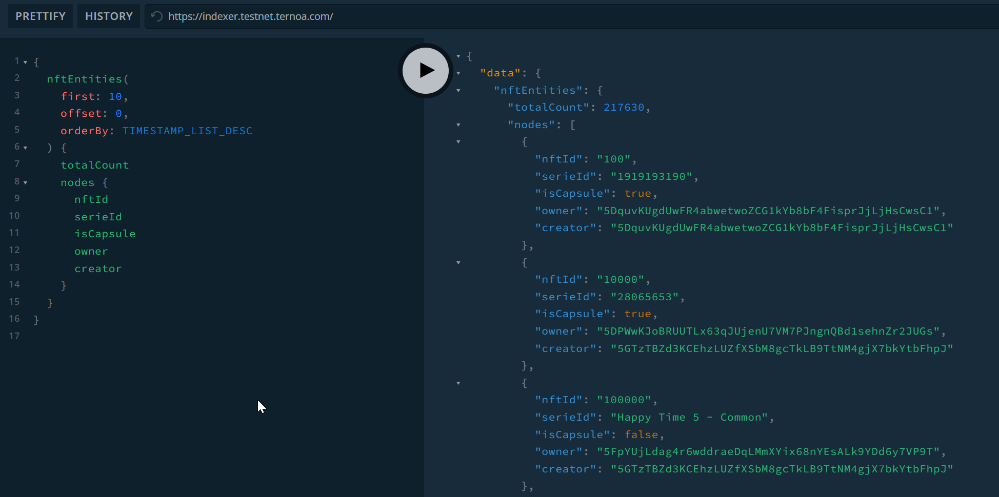
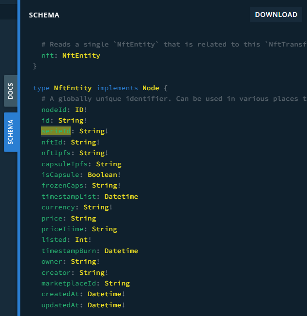

# Playground

## Use it from an App

You can go to [our indexer](https://indexer.testnet.ternoa.com/) and directly query any data needed.

you just need to create the graphql request, for example, a simple request to get the 10 last listed nft: 
```graphql
{
  nftEntities(
    first: 10, 
    offset: 0, 
    orderBy: TIMESTAMP_LIST_DESC
  ) {
    totalCount
    nodes {
      nftId
      serieId
      isCapsule
      owner
      creator
    }
  }
}
```
Same example in the playground:


You can access the hole schema in the right panel of the playground:


Or directly in our [repository](https://github.com/capsule-corp-ternoa/ternoa-subql/blob/main/schema.graphql)