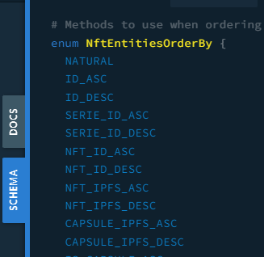

# Ordered queries

In this section, you'll see how to order queries:

> You can try this directly in our [indexer's playground](https://indexer.testnet.ternoa.com/)

Each field generate a sort option that you can apply on any request. For example:

## Query NFTs ordered by creation timestamp

```graphql
{
  nftEntities(
    filter: { listed: { equalTo: 1 } }
    first: 10
    offset: 0
    orderBy: TIMESTAMP_CREATE_DESC
  ) {
    totalCount
    nodes {
      id
      serieId
      listed
      isCapsule
      timestampList
      price
      marketplaceId
      nftIpfs
    }
  }
}
```

You can put as many sort fields as you need:

## Query NFTs ordered by creation timestamp, isCapsule field, price

```graphql
{
  nftEntities(
    filter: { listed: { equalTo: 1 } }
    first: 10
    offset: 0
    orderBy: [TIMESTAMP_CREATE_ASC, IS_CAPSULE_ASC, PRICE_ASC]
  ) {
    totalCount
    nodes {
      id
      serieId
      listed
      isCapsule
      timestampList
      price
      marketplaceId
      nftIpfs
    }
  }
}
```

> You can access all the different orders in the schema tab on the right panel of the [graphql playground](https://indexer.testnet.ternoa.com/).

> 