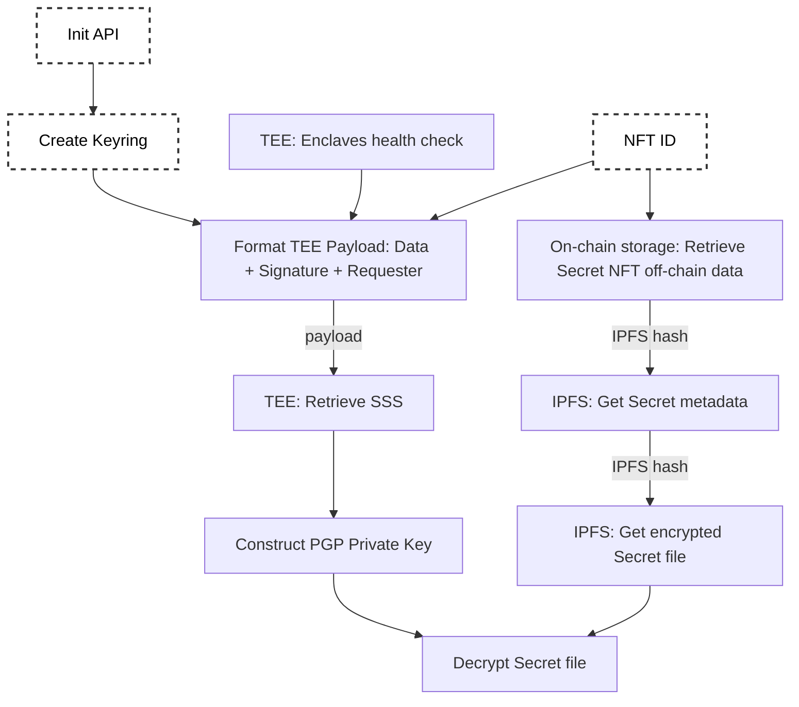

# Decrypting a Secret NFT

## Custom and destructured flow

- How to retrieve Secret NFT assets

  - Ternoa IPFS Client

- How to prepare payloads for TEE enclaves

  - Enclave health status
  - Payload formatting
  - Get request

- How to retrive Secret Key

  - Shares combined

- How to decrypt the secret
