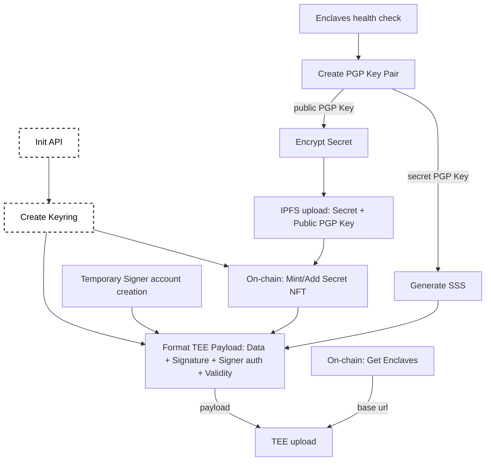
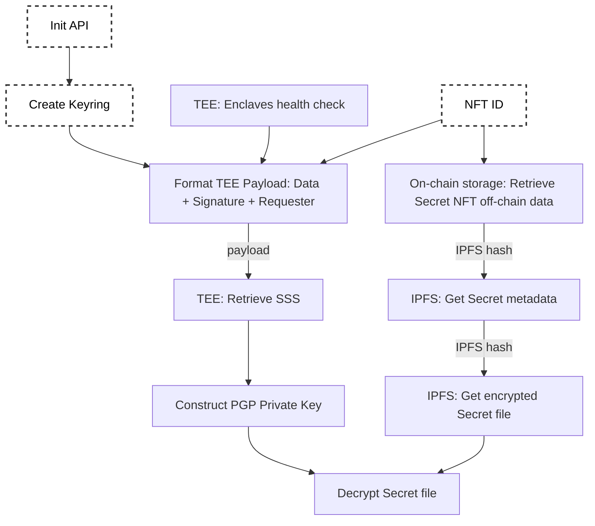

# Minting & Decrypting flows

:::info
The following schemas and descriptions mention the Secret NFT as an example. Nevertheless, those schemas as also valuable for the Capsule NFT as the concept behind the two flows is the same for both of them.
:::

## Minting a Secret NFT

### Custom and destructured mint flow

- How to generate the Secret key

  - PGP Key Pair creation
  - Secret Shamir Shares generation

- How to prepare Secret NFT assets

  - Off-Chain Metadata: Secret NFT metadata, Secret Media Metadata
  - Secret file encryption
  - Ternoa IPFS Client

- How to mint a Secret NFT on-chain using Ternoa-JS: injecting a Signer account

- How to prepare payloads for TEE enclaves

  - Temporary signer account creation
  - Payload formatting

- How to store shares on TEE enclaves
  - Enclave health status
  - Post request

# Decrypting a Secret NFT

### Custom and destructured decryption flow

- How to retrieve Secret NFT assets

  - Ternoa IPFS Client

- How to prepare payloads for TEE enclaves

  - Enclave health status
  - Payload formatting
  - Get request

- How to retrieve Secret Key

  - Shares combined

- How to decrypt the secret
