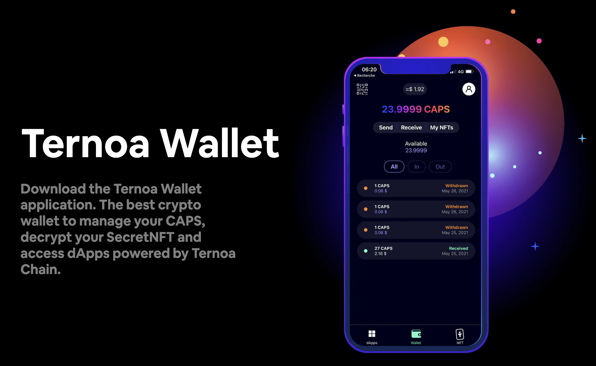
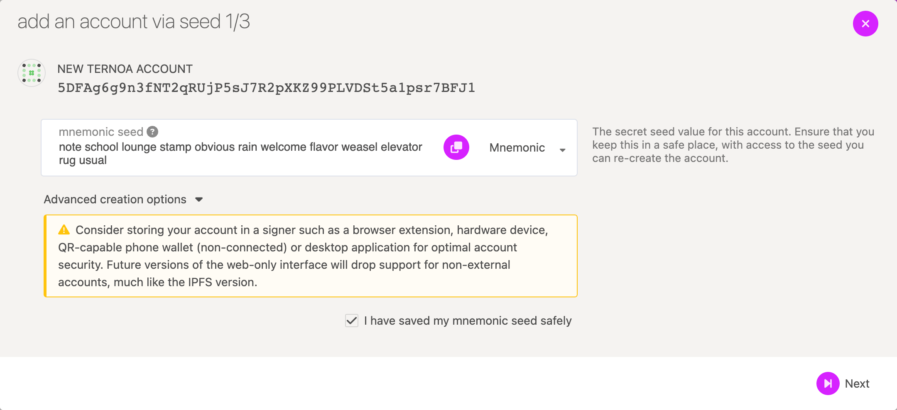

# Create Your Ternoa Account

Before starting building your decentralized application (dApp) on top of the Ternoa chain you will need a **Ternoa account**.

## Step 1: Create Your Ternoa Account

### Download Ternoa Wallet App

The easiest way to create an account is to use the [Ternoa Wallet](/wiki/wallet/) 📱

## Step 2: Get Some Free Test CAPS tokens

Usually, you start building your dApp on the Alphanet network with claimed CAPS tokens from the faucet.
Extending it to the Mainnet network will be as simple as changing the WebSocket endpoint.

The Alphanet faucet provides you with some free test CAPS tokens to start building on Ternoa on the Alphanet network.

It is accessible via the [Ternoa website](https://faucet.ternoa.network/).

Paste your fresh Ternoa account address created previously (it starts with the number `5` e.g. `5DFAg6g9n3fNT2qRUjP5sJ7R2pXKZ99PLVDSt5a1psr7BFJ1`), verify the captcha and click on the `Claim` button.

You will receive alpha CAPS tokens in a few minutes.

If the daily 100 CAPS is not enough, feel free to reach us on [Discord](https://discord.com/invite/mQeEWQj46a) for more.

## Bonus: Alternatives Ways

### Polkadot Portal

You can also create a Ternoa account from the [Polkadot Portal](https://polkadot.js.org/apps/?rpc=wss%3A%2F%2Fmainnet.ternoa.network#/accounts):

First click on the `+ Account` button.

A modal will pop up displaying your account address starting with the number `5` and a secret mnemonic sequence of words: this is your secret seed phrase.

:::caution
You should back up these words. Please, store the seed somewhere safe, secret, and secure. If you cannot access your account, you will be able to restore it using those words.
:::info

Click on the checkbox and moved to step 2.

Fullfil inputs with a descriptive name for your account and a strong password. Finally, in step 3 click on the `+ Save` button.

Congratulations your account is created 🎉

### Extensions

Use an extension browser to simplify transactions signing:

Official:

-   [Polkadot{.js} extension](https://polkadot.js.org/extension/)

Alternatives:

-   [Talisman](https://docs.talisman.xyz/talisman/navigating-the-paraverse/account-management/download-the-extension)
