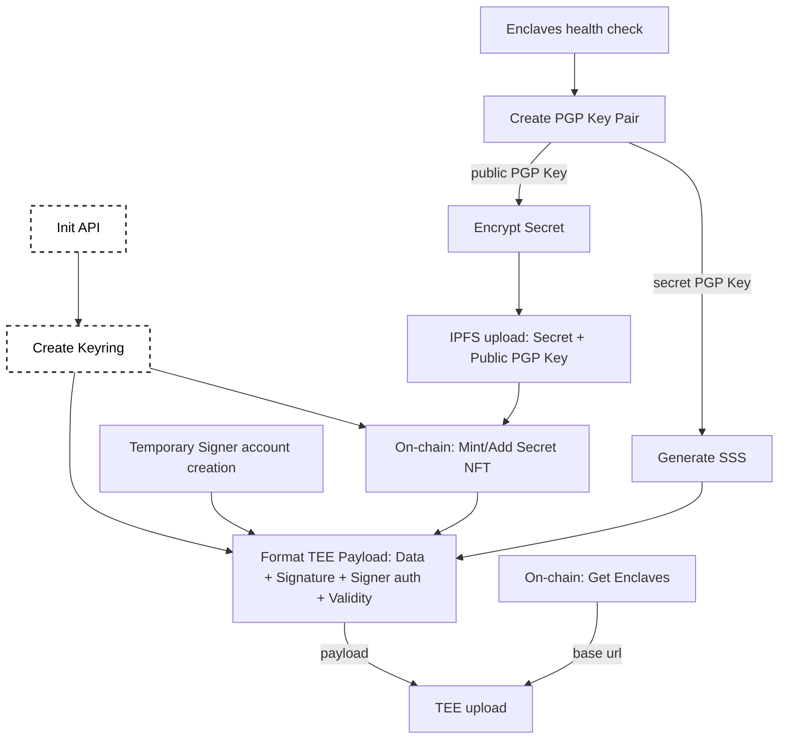

# Secret NFT

A Ternoa Secret NFT is a unique type of NFT that incorporates encrypted data, making it more secure and exclusive than a Basic NFT. Only the current owner of the Secret NFT has access to the encrypted data at any given time.

