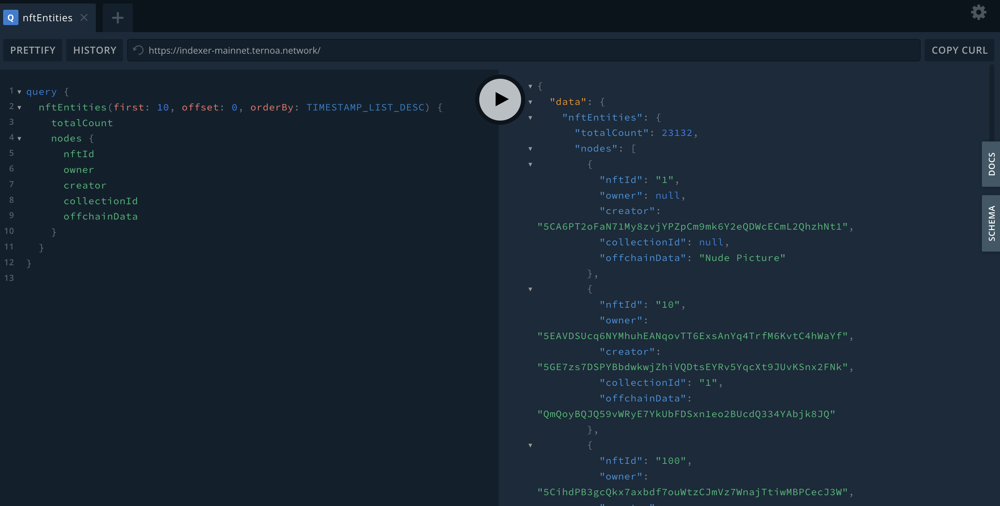

# Playground

## USE IT FROM PLAYGROUND

Depending on the data you are looking for, you can directly query any data needed on:

- **[The Alphanet indexer](https://indexer-alphanet.ternoa.dev/)**
- **[The Mainnet indexer](https://indexer-mainnet.ternoa.network/)**

#### You just need to create the graphql request, for example, a simple request to get the 10 last listed nft:

```graphql
{
  nftEntities(first: 10, offset: 0, orderBy: TIMESTAMP_LIST_DESC) {
    totalCount
    nodes {
      nftId
      owner
      creator
      collectionId
      offchainData
    }
  }
}
```

#### Same example in the playground:



#### You can access the hole schema in the right panel of the playground:


Or directly in our **[repository](https://github.com/capsule-corp-ternoa/ternoa-subql/blob/main/schema.graphql)**.
