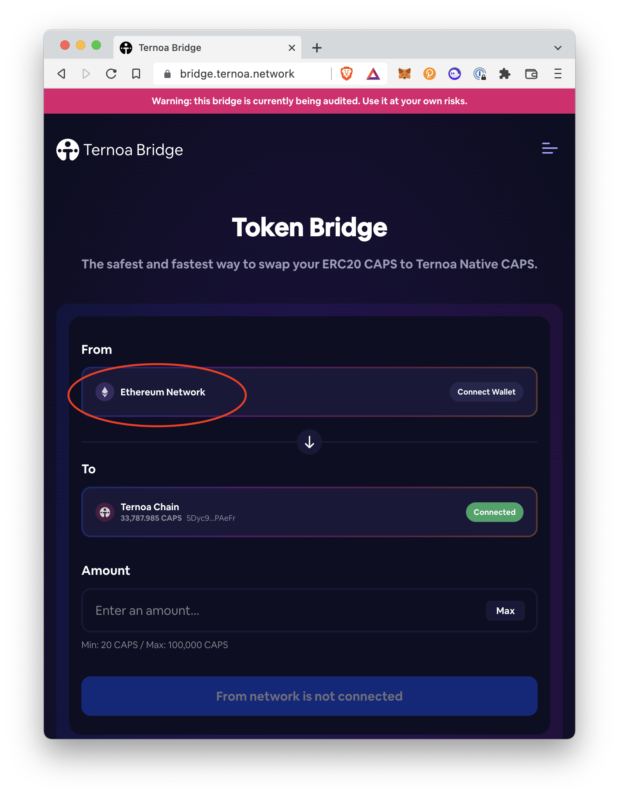
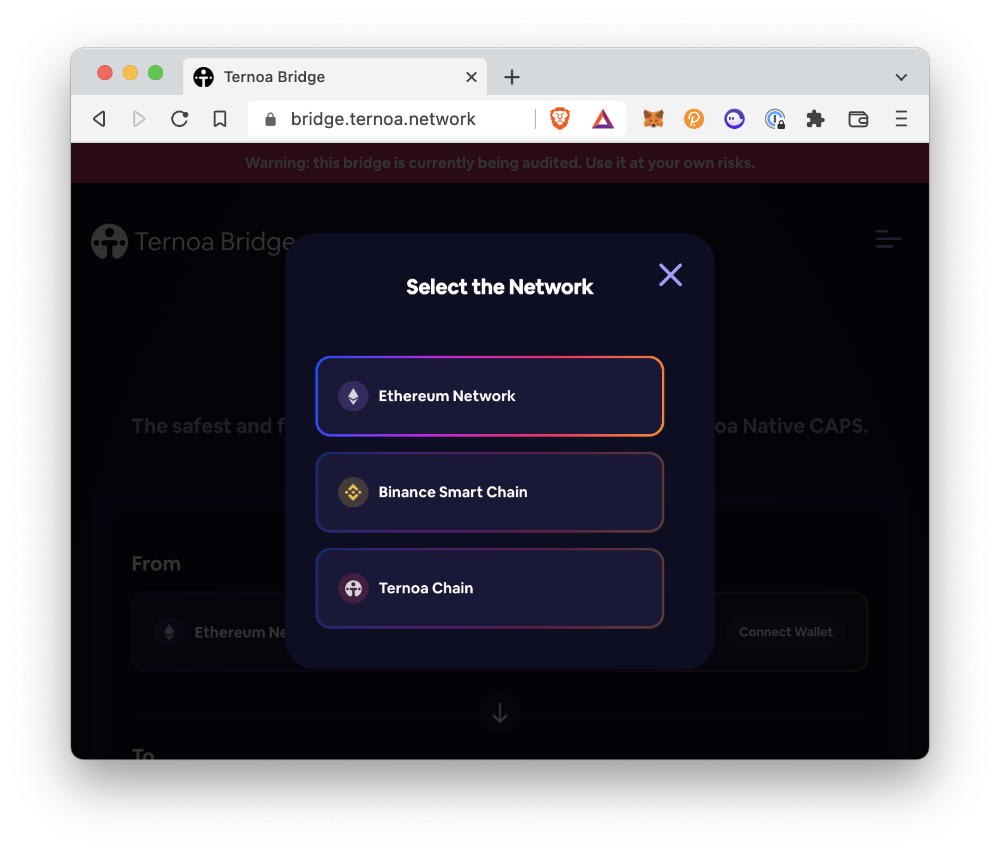
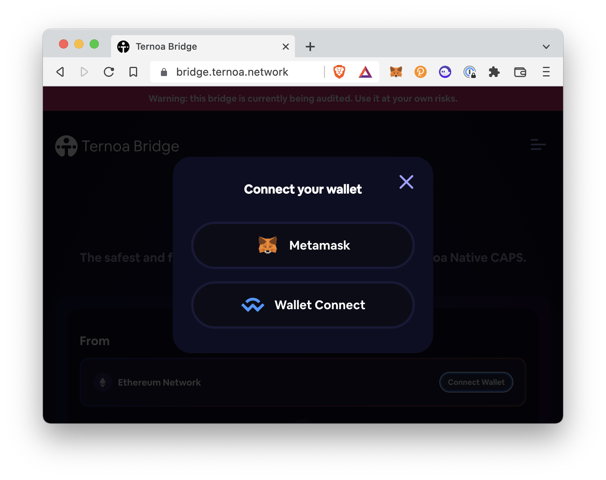

# ERC20 CAPS <-> Native CAPS

> How to bridge ETH (Ethereum) CAPS & Ternoa CAPS ? 

## 1. On the [Token Bridge](https://bridge.ternoa.network/), click on the drop down menu under From

___

## 2. Click the Ethereum Network button

___

## 3. To connect your wallet, click the "Connect Wallet" button

___

## With Wallet Connect

1. Click **Wallet Connect**
2. Either scan the QR code with a WalletConnect-compatible wallet or click **Desktop**
3. Choose your preferred wallet from the selection. Now you are connected!
4. Click on the dropdown under the **'To'** button and choose **'Ternoa Chain'**
5. Select **'Connect Wallet'** and connect Polkadot using the Polkadot{.js} **[browser extension](https://polkadot.js.org/extension/)**
6. Select your desired wallet
7. Enter the amount of ERC20 CAPS in the **Amount** section 
- Note: the minimum is 200 CAPS and the maximum is 200,000 CAPS
8. Click **Continue**
9. On the Confirmation pop up, read and agree to the terms
10. Click **Continue**
11. Your Transfer is in progress and will take between 2 to 5 minutes.
12. Once completed, you will see a transaction successful notification
13. To view the transaction, click **View transaction** at the bottom of the notification
