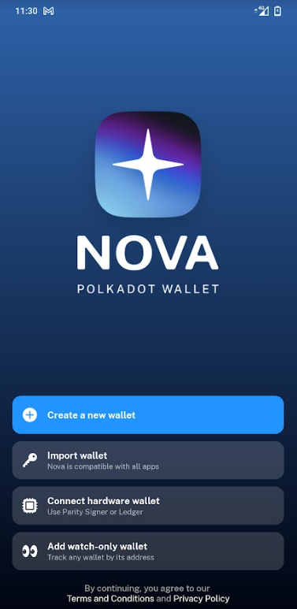
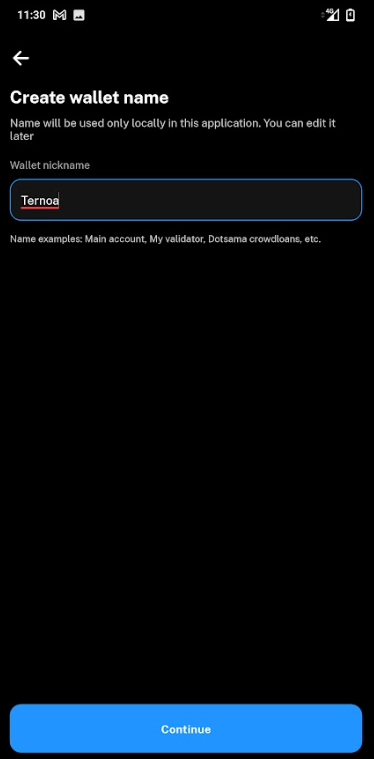
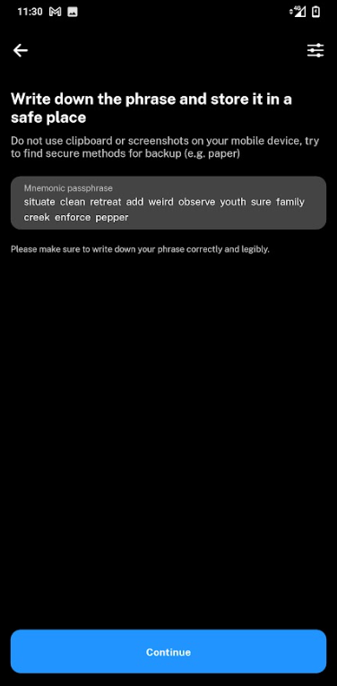

# Nova Wallet

> Nova wallet is a non custodial wallet mobile app that allows you to manage (transfer, stake and so on) your ternoa account let’s see how to set it up.

Download the wallet on your mobile using **[this link](https://play.google.com/store/apps/details?id=io.novafoundation.nova.market)**
On the starting screen you’ll see the different options to create or import a wallet. If you already have a ternoa wallet click on “import wallet”, if not, please hit “create a new wallet”. If you’re importing an existing wallet, go directly to step.

___

## Create a new Wallet

Click on **“create a new wallet”**, you’ll be asked to name your wallet, enter the name of your choice then click on **“Continue”**

___

## Save your passphrase
This is a critical phase, the passphrase is the key to your wallet, it’s crucial to keep it secured and NEVER share your passphrase with anyone (there is no good reason to give it to someone else, even from the Ternoa or Nova staff) Once properly saved, please click on “Continue”
## Tap your passphrase
You will be asked to enter your passphrase on this screen. Proceed and click on Continue. Your wallet is now all set! Congrats!