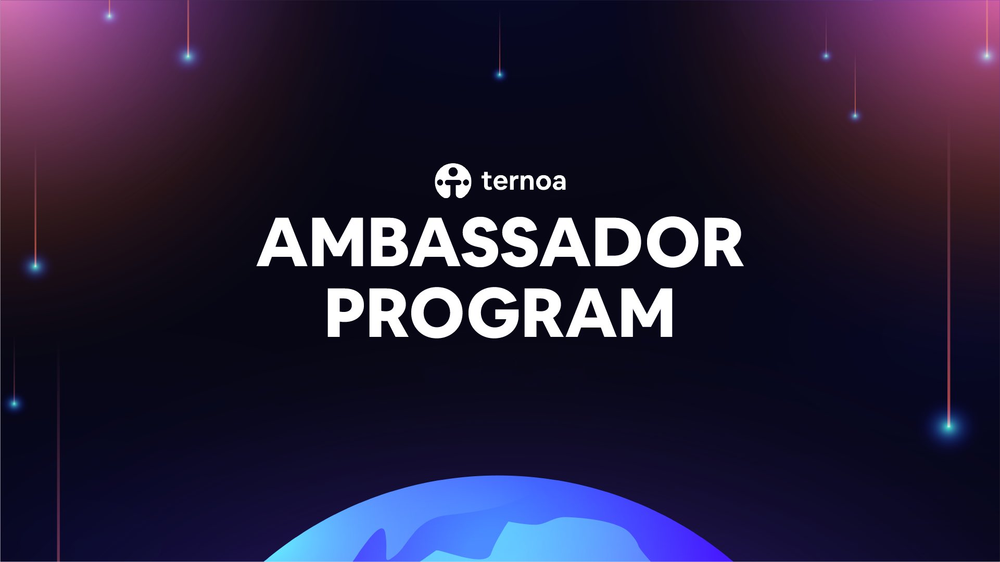

# Ambassador Program

Ternoa's Ambassador Program is a vital part of going worldwide! Become a Ternoa ambassador right now and start earning rewards. Let's bring Ternoa to every continent on this Earth.

 + To connect to our Ambassador program and discover quests follow this link: **[https://ternoa.crew3.xyz/questboard](https://ternoa.crew3.xyz/questboard)** 
 + To stay up to date on future Ambassador rewards, follow us on Twitter: **[https://twitter.com/Ternoa_](https://twitter.com/Ternoa_)**

# Why Become a Ternoa ambassador?

To build a strong community, earn rewards and receive tokens for completing specific tasks. To make it even more compelling, we'll announce the Top 3 ambassadors every half a year who will earn even more rewards. 

**Ternoa Extended team** - be part of a larger community of enthusiasts and become a key contributor to the Ternoa ecosystem.

Quests won't only help Ternoa; you will gain experience in web3 and build a name for yourself. Improve your skills and gain notable expertise to push your career to new heights.

# Who is eligible to become a Ternoa ambassador?

+ You're a developer, NFT enthusiast, a web3 leader, an influencer, or a crypto expert. 
+ You're passionate about web3 and blockchain and care about building a strong and long-lasting community for Ternoa. 
+ You are an existing community leader and can promote Ternoa within your group. You are a marketing and content creator. 
+ You love building content and have out-of-the-box ideas. You are a student interested in blockchain and NFTs and want to gain hands-on knowledge of this ever-changing space. 
+ You can still become a Ternoa Ambassador even if you are not tech-savvy. 

# What do we expect from you?
There's no one-size-fits-all to how to be a Ternoa ambassador, but here are some examples: 

+ Promote Ternoa through meetups and AMAs. These meetups can be structured to be both technical and non-technical, so all can participate. 
+ Create compelling content. As the Ternoa community grows, we'll need blog posts, documents, and other content translated into several languages. 
+ Amplify Ternoa News and Announcements. 
+ Help us become a global brand and manage our online communities in various languages and channels (Kakao, Telegram, WeChat, etc.) Set up regular AMAs and Meetups, and bring new people to the Ternoa community. 
+ Complete one-off tasks like creating blog posts, infographics or virtual stickers and helping build our website, among other things. Of course, there are plenty of rewards to win!

# Quests

For completing our quests, we will be using Crew3, integrated into a Discord that allows us and our Ambassadors to manage and track each task and its progress.

To have access to the Crew 3 board: 
+ Log in to Crew3 **[Crew3](https://ternoa.crew3.xyz/)** with Discord 