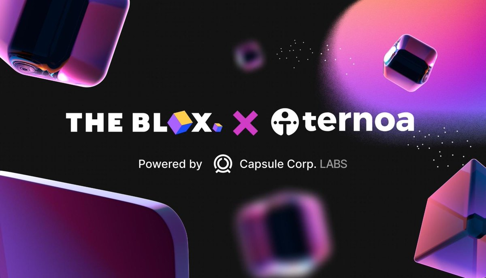

# Accelerator Program

**The Blox and Ternoa** have entered a partnership to give builders the opportunity to turn their projects into startups and receive grants and funding. 

The goal of this program is to bootstrap innovative Web3 projects building top-notch NFT and Metaverse solutions on the Ternoa blockchain. Projects will develop their product and business model with the help of The Blox’s resources during a 3-month acceleration period.

To learn more and apply for the Ternoa Accelerator program **[click here](https://www.theblox.co/ternoa-the-blox-accelerator-program/)**.