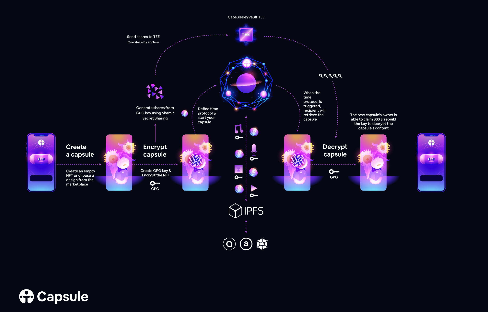

# Capsule

Ternoa has created the **"Capsule NFT"** which uses a NFT to store unlimited confidential data. This NFT can support transmission protocols.

# Security

# GPG
Capsule NFT is protect outside and inside. Content is automatically encrypted using the asymmetric GPG encryption process. Guaranteeing authenticity, integrity and confidentiality.

# Shamir's Secret Sharing
Ternoa Chain uses  algorithm to secure Capsule NFT. The GPG Keys are divided into shares and then sent to different nodes ensuring security and total decentralization.

# Backup of the Capsule shares
Each Capsule NFT has share which allows the NFT owner to decrypt them. Those shares are encrypted and saved on.

When the owner of the Capsule NFT requests access to the shares, the network validate given informations before triggering the shares opening. These conditions are managed by the Ternoa .

# Capsule TIP

[**View Capsule TIP**](https://github.com/capsule-corp-ternoa/ternoa-proposals/blob/main/TIPs/tip-530-Capsule.md) 