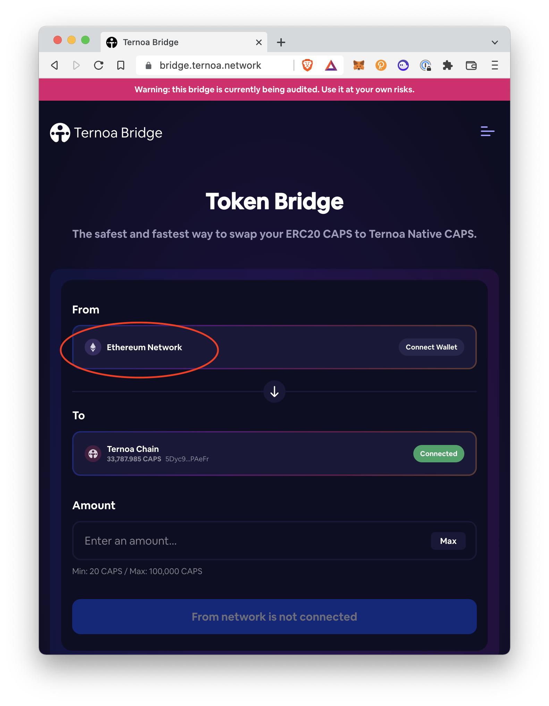
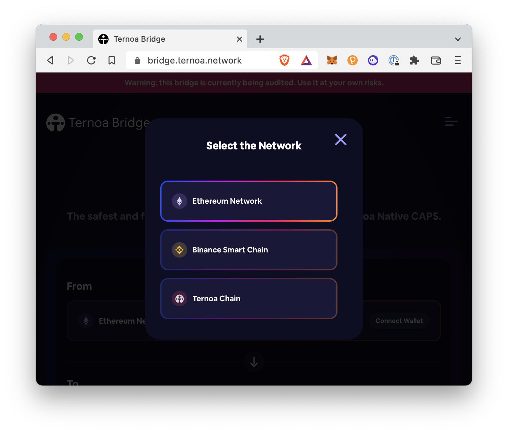
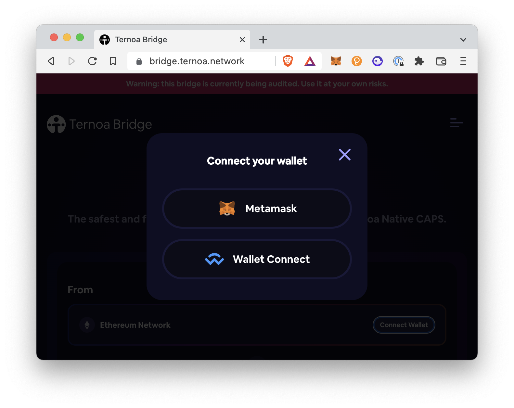

# ETH <-> CAPS
> Steps for bridging Ternoa native CAPS and ERC20 CAPS.

### 1. From the [Token Bridge](https://alphanet.bridge.ternoa.network/) on Alphanet, click on the left side of the From button

___

### 2. Click the Ethereum Network button

___

### 3. To connect your wallet, click "Connect Wallet" button

___

### With Wallet Connect
1. Click **Wallet Connect**
2. Either scan the QR code with a WalletConnect-compatible wallet or click **Desktop**
3. Choose your preferred wallet from the selection. Now you are connected!
4. Click the left side of the To button and choose "Ternoa Chain".
5. lick the right side of the To button and connect your Polkadot Wallet using the **[polkadot.js extension](https://polkadot.js.org/extension/)** (chrome/firefox).
6. Select your desired wallet
7. Enter the amount of ERC20 CAPS in the Amount section 
* Note: the minimum is 200 CAPS and the maximum is 200,000 CAPS
8. Click **Continue.**
9. On the Confirmation popup, check the I Have Read and Agree to the Terms checkbox.
10. Click **Continue**
11. You should see a Transfer in progress... notification. The transfer will take between 2 and 5 minutes.
13. To view the transaction, click **View transaction** at the bottom of the notification.
