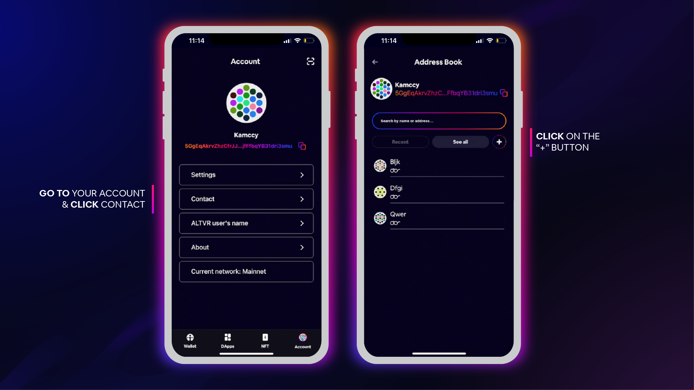
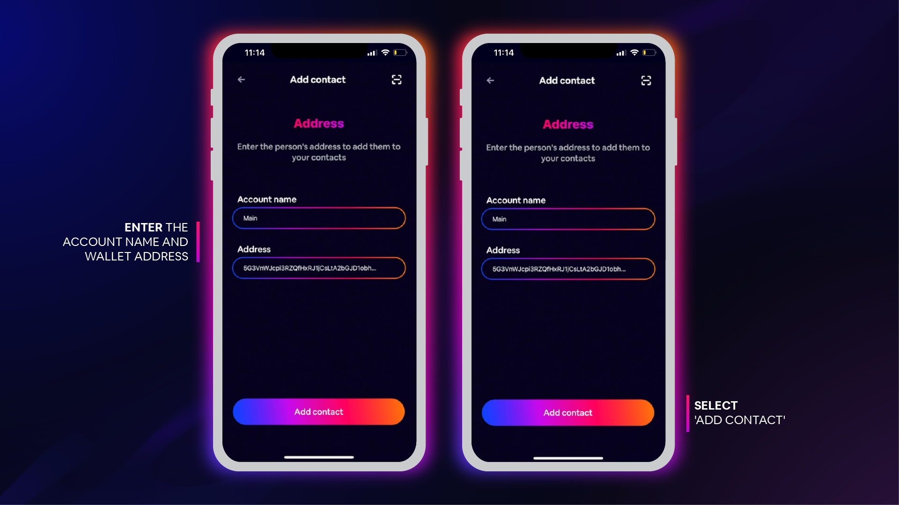
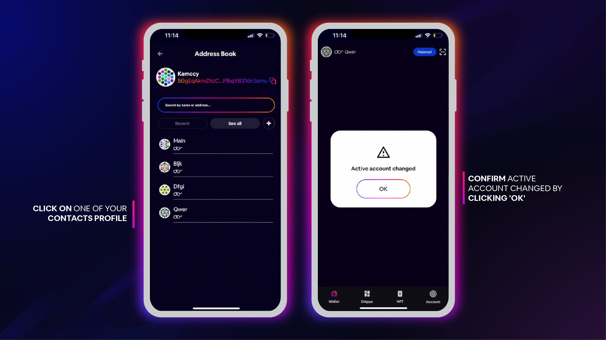
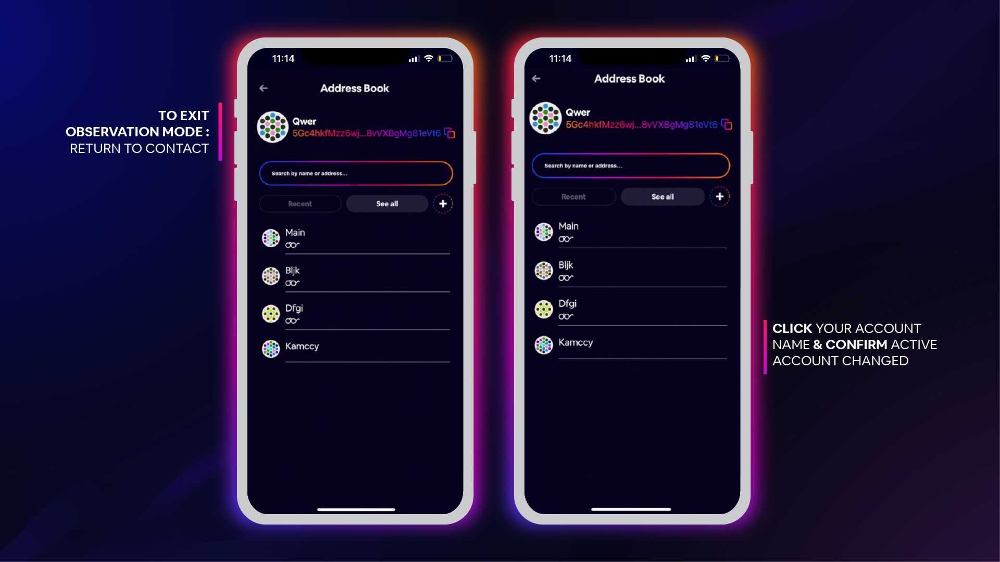

# Account

## Wallet Address

You can find your **Ternoa Wallet Address** in the **Profile** area of the app.

___
## Change Password

Here you can change the **App Password.**

___
## Check your Mnemonic Key

Here you can check your **Mnemonic Key.**

___
## Contact
From your **Address Book**, you can add and review recent contacts, and observe other accounts. 

___

### Observe Contacts

