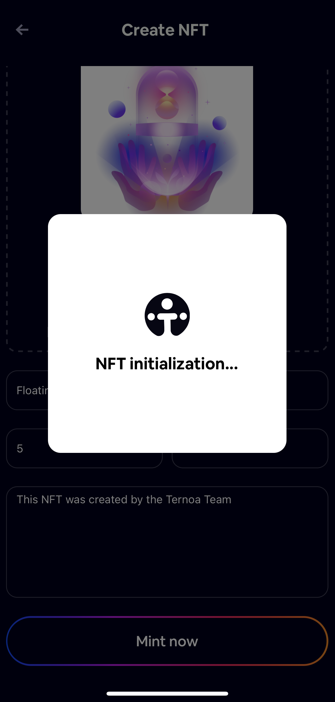
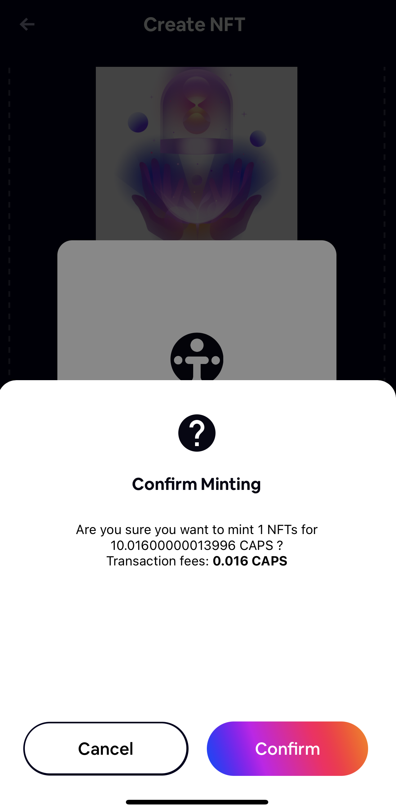
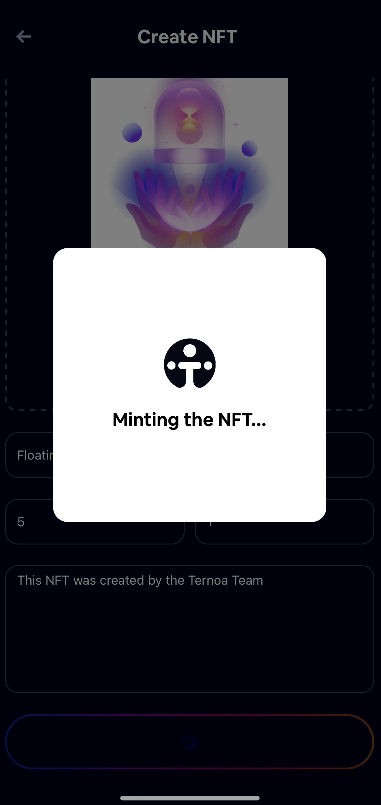

# Create NFT

## To create an NFT, follow the tutorial below:

### 1. Go to the NFT tab in your Ternoa Wallet

___
### 2. Click 'Create new NFT'

___
### 3. Select 'Choose a file' 

:::info
**You can upload image, audio, text file, and video:**
- File size: max 30mb
- Allowed extensions: JPEG, JPG, PNG, GIF, MP4 or MOV
- Preview: For audio, text file, & video you will need to add a preview image 
:::
___

### 4. Input your NFT data, then click 'Mint now'

:::info
Royalties give you a percentage of the sale price each time your NFT is traded on a Ternoa chain. NFT royalty payments are perpetual and are executed automatically.
:::

:::caution
**Once this information is submitted, it is impossible to update.**
:::
___

### 5. The NFT initializing process will begin

___

### 6. Confirm Minting transaction fees 

___

### 7. Input password  

___

### 8. Minting begins 

___

### 9. NFT creation completed!  

:::info
It will take a few seconds before your NFT will be visible in your Ternoa Wallet
:::
___

___

## Send NFT

### To send an NFT, follow the tutorial below:

1. Select an **NFT** to send 
2. Click 'Send to someone' 
3. Paste the wallet address or click on + to send to a specific account 
4. Click **'Next'**
5. Confirm the transfer fees 
6. Input your password 
7. Transfer **completed!**

