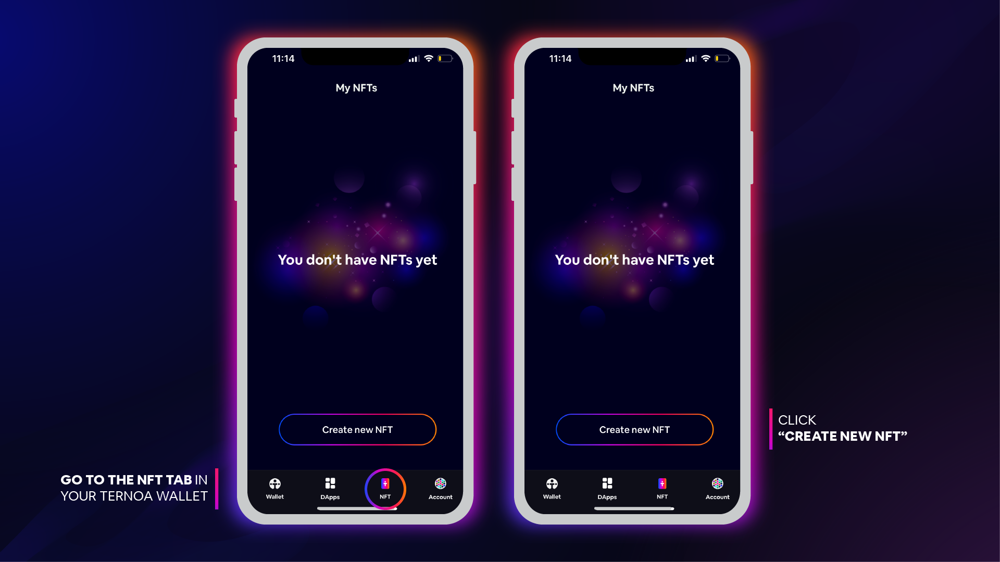
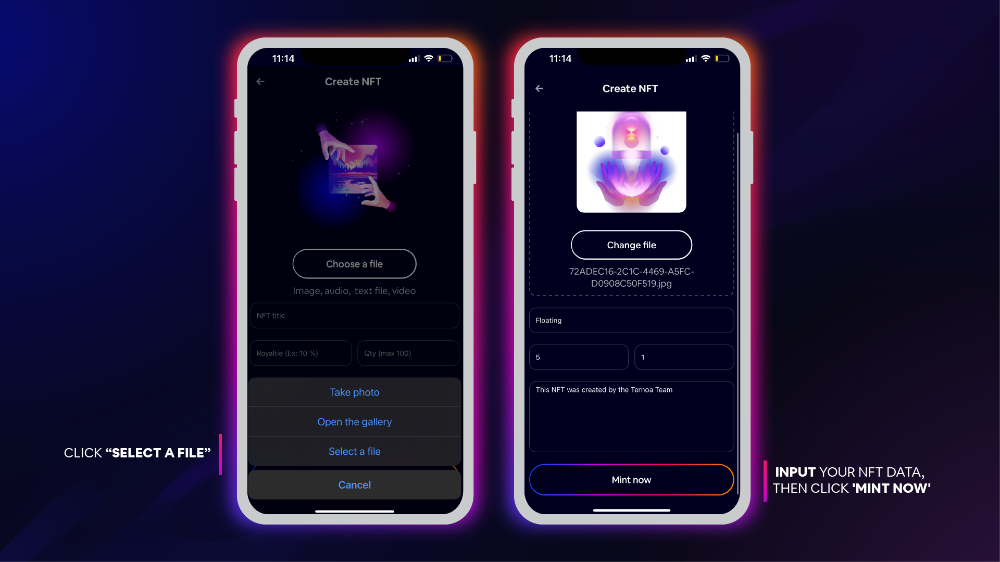
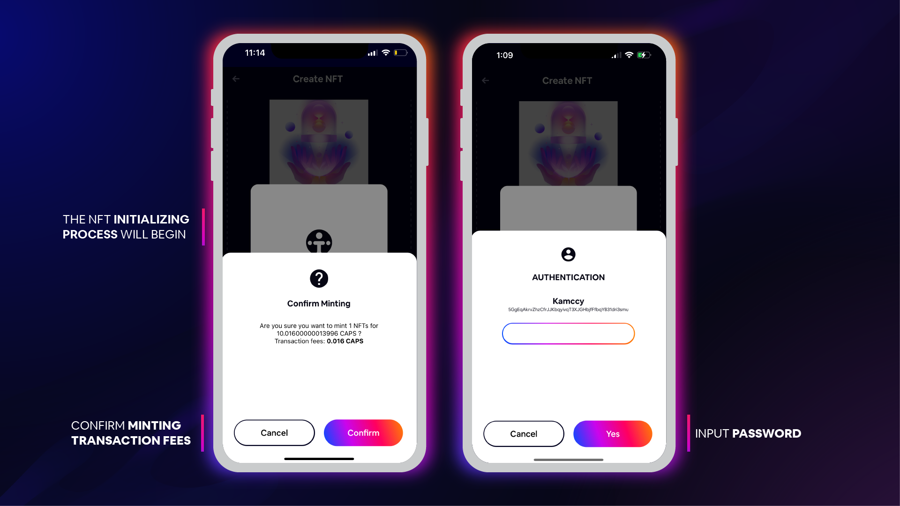
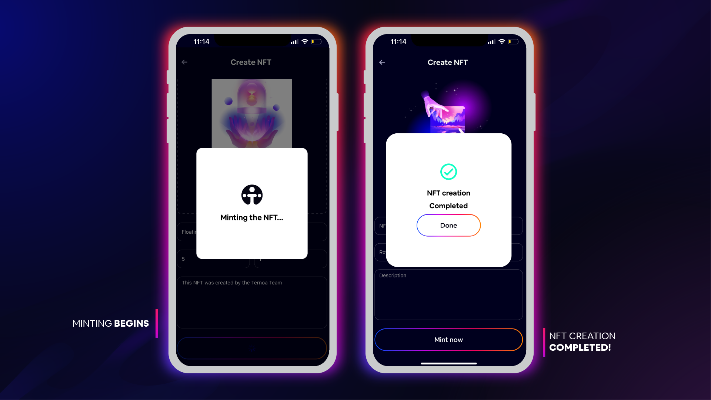

# Create NFT

## To create an NFT, follow the tutorial below:

:::info
You can upload image, audio, text file, and video:
- File size: max 30mb
- Allowed extensions: JPEG, JPG, PNG, GIF, MP4 or MOV
- Preview: For audio, text file, & video you will need to add a preview image 
:::

:::info
Royalties give you a percentage of the sale price each time your NFT is traded on a Ternoa chain. NFT royalty payments are perpetual and are executed automatically.
:::

:::caution
Once this information is submitted, it is impossible to update.
:::

___

## Send NFT

### To send an NFT, follow the tutorial below:

