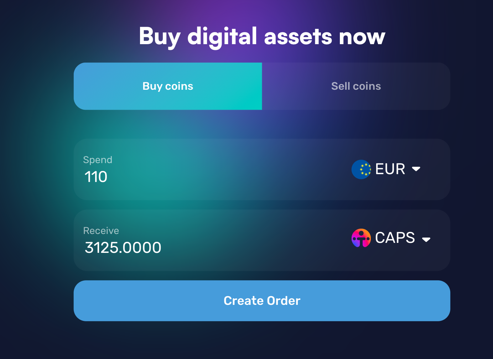
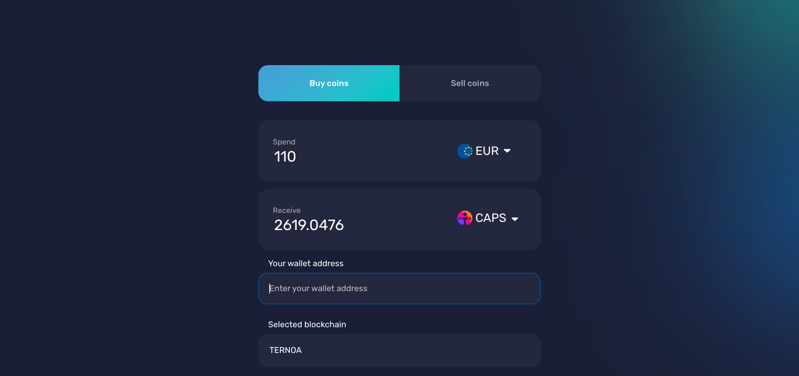
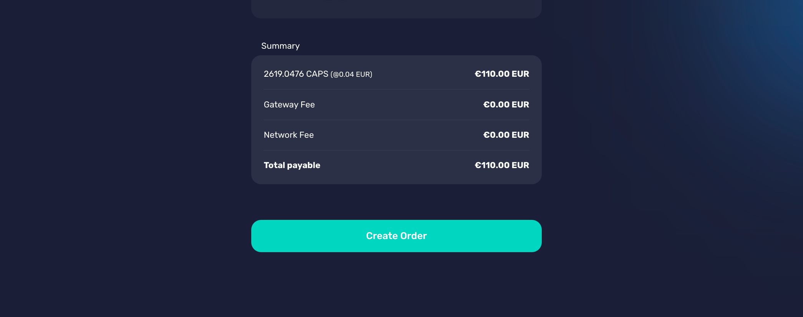
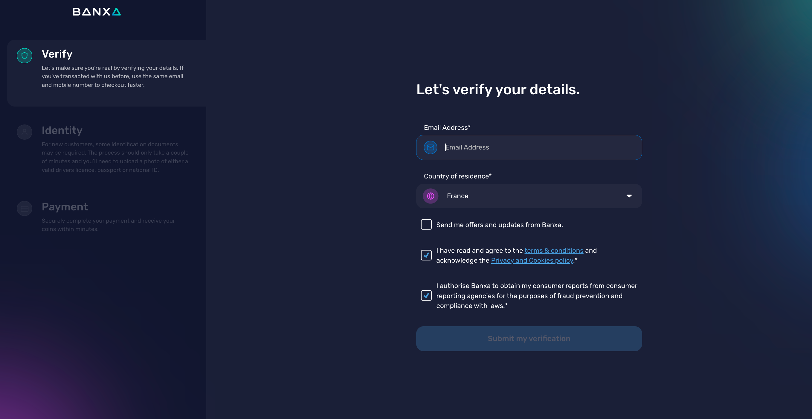
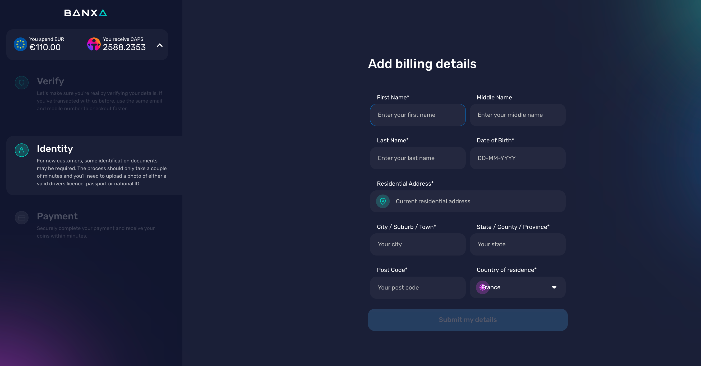
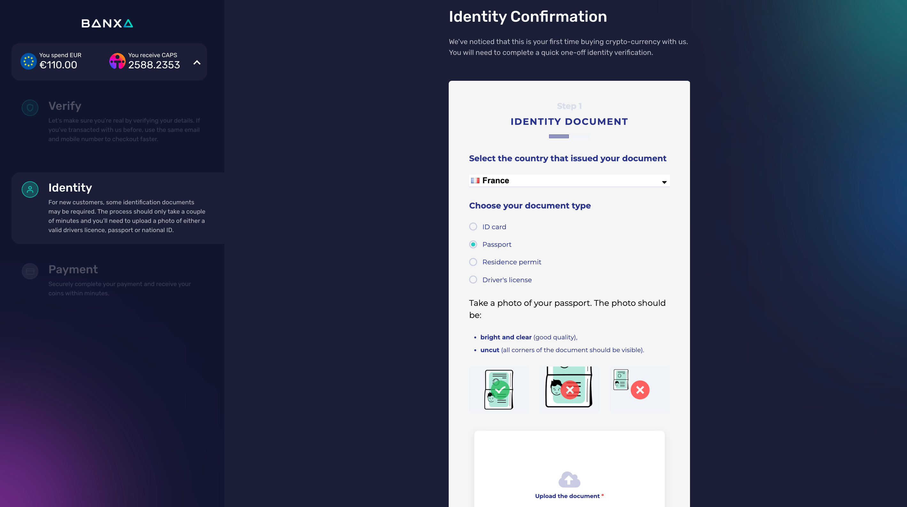
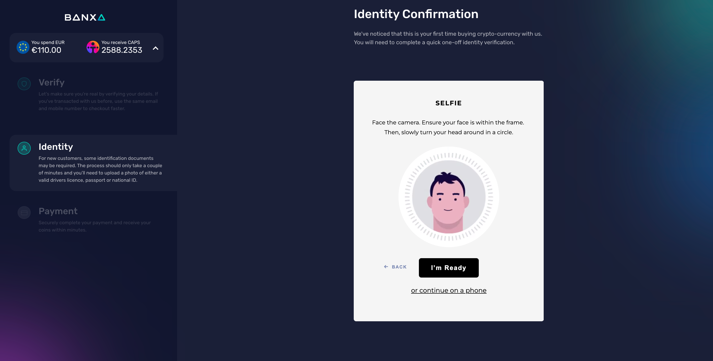
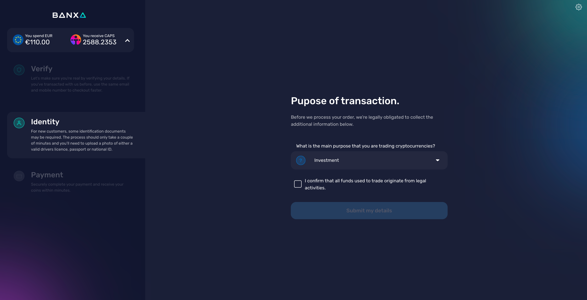
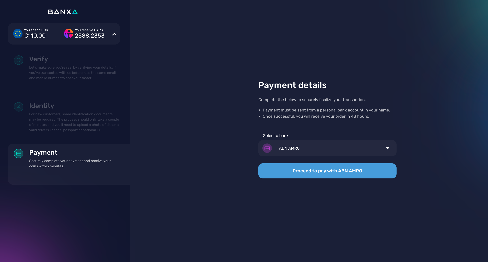

# How to Buy CAPS

Ternoa has integrated with Banxa, one of the world's fastest-growing fiat-to-crypto gateways to purchase CAPS accessible directly through **[Banxa](https://banxa.com/)**.

> Before starting your order, make sure you have your credit card on hand and your passport, then you are all set to start the process of purchasing CAPS. 

## How to create your order

1. Go to Banxa.com: **[https://banxa.com/](https://banxa.com/)**

2. Select the currency you would like to use to purchase your CAPS using the dropdown arrow, then select CAPS to receive, and click **Create Order**.

:::info
Please note there is a minimum amount required to purchase CAPS, which is subject to change. 
:::

3. Input your Wallet Address

4. Select Payment method click **Create Order**

5. Begin creating your account by verifying your details 

6. Add your billing details

:::info
There are some countries where Banxa services are not currently available. Please review **[this list](https://support.banxa.com/en/support/solutions/articles/44002216505-what-countries-are-supported-by-banxa-)** for countries where services are not available. 
:::

7. Confirm your idenity by uploading a photo of your passport

8. Click **I'm Ready** and take a selfie

9. Select the purpose of your purchase

10. Select your bank and proceed to pay, you will be directed to your chosen payment option

:::info
The time to process your order can vary due to a number of factors. Review **[this list](https://support.banxa.com/en/support/solutions/articles/44002216503-how-long-will-my-order-take-)** for process times. 
:::

11. Get ready to receive your **CAPS in your Wallet**!

___
You will receive a confirmation email from Banxa confiriming your payment. Please be sure to read their emails in detail regarding next steps, as you may be required to further verify your credit card by taking a photo of it, or resubmit your passport via email. If you have any questions regarding your order reach out to: **[https://support.banxa.com/en/support/tickets/new](https://support.banxa.com/en/support/tickets/new)**

